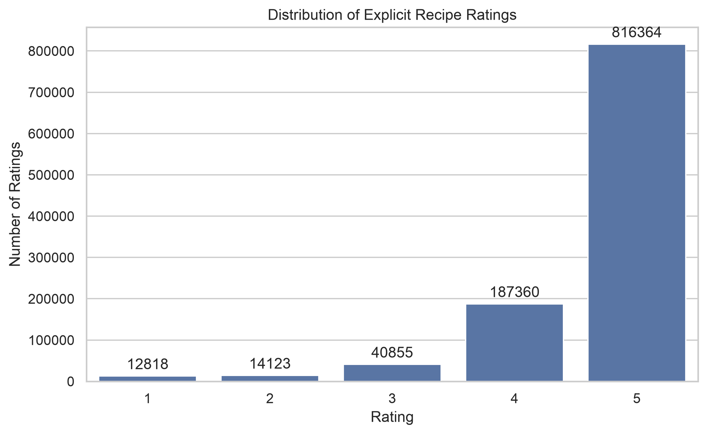
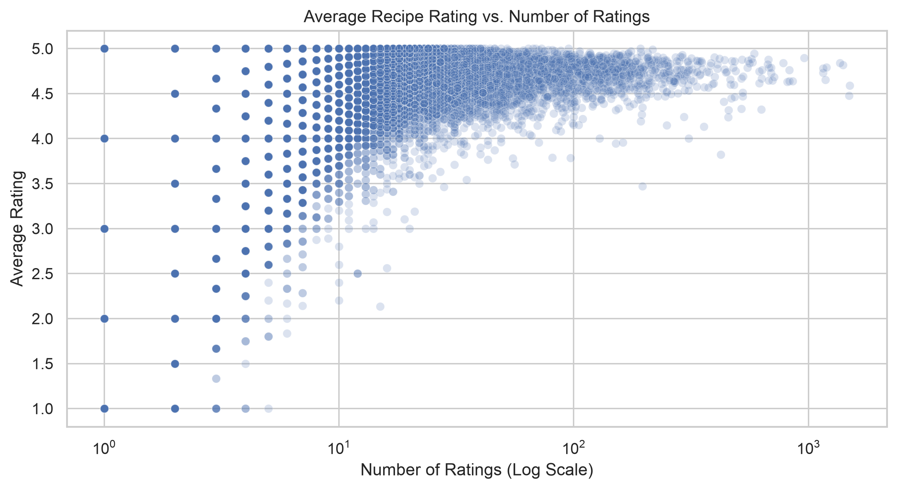
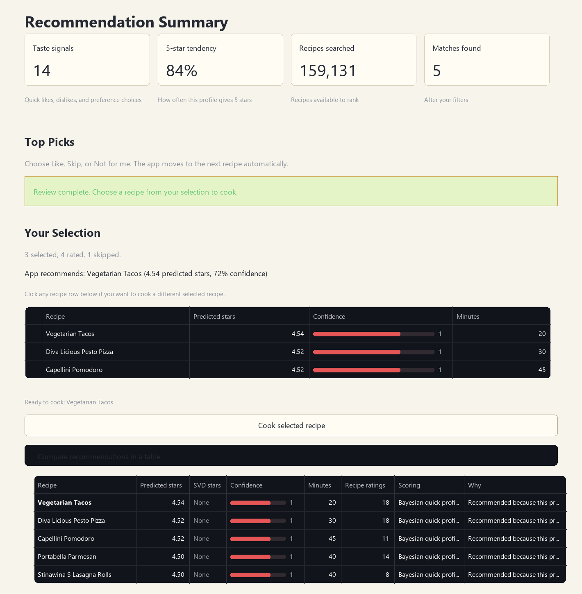
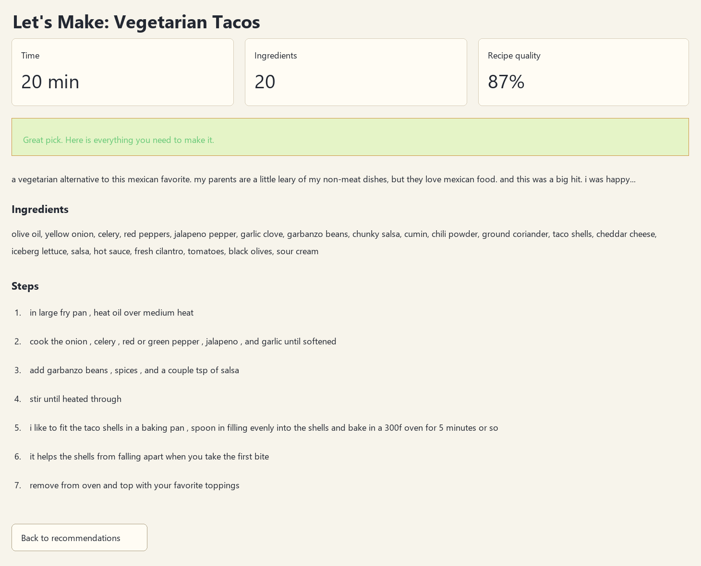

# Bayesian Personalized Recipe Recommendation System

This project is a hybrid recipe recommendation system using the Food.com Recipes
and User Interactions dataset. It combines **SVD collaborative filtering** with
**Bayesian updating** so recommendations can use both historical rating patterns
and the current user's preferences.

The final project includes:

- a cleaned notebook pipeline
- exploratory data analysis and feature engineering
- SVD, Bayesian, and hybrid recommendation logic
- saved model outputs and evaluation metrics
- a customer-friendly Streamlit demo

## Part 1: Project Summary

Food recommendation systems often give recipes without explaining why the recipe
was chosen or how confident the system is.

Our project solves this by recommending recipes using:

- the user's rating history
- similarities to other users
- cuisine preferences
- dietary needs
- ingredients
- cooking time
- historical recipe quality
- quick feedback such as **Like this**, **Not for me**, and **Skip**

The goal is not just to recommend a recipe. The goal is to recommend a recipe,
explain why it fits the user, and show how confident the system is.

## Part 2: Main Idea, SVD, And Bayesian Updating

Our recommender has two main model parts:

1. **SVD** learns from historical ratings.
2. **Bayesian updating** adjusts recommendations as the user gives feedback.

Key takeaway:

*SVD tells us what similar users liked, and Bayesian updating tells us how to
adjust that recommendation for this specific user's current preferences.*

### What Is SVD?

SVD stands for **Singular Value Decomposition**. In this project, we use it as a
collaborative filtering model.

Collaborative filtering means the model learns from user-recipe rating patterns.
It looks for patterns like:

- users who liked recipe A also liked recipe B
- users with similar taste often rate similar recipes highly
- some recipes are generally rated higher than others

Example:

If a user liked **Butter Chicken** and **Garlic Naan**, SVD can look at other
users with similar taste and suggest recipes those users also liked, such as
**Chicken Tikka Masala** or **Paneer Butter Masala**.

SVD answers:

*Based on past ratings from many users, what recipes is this user likely to
enjoy?*

In the Streamlit app, SVD is used in **Saved Customer Profile** mode because
those users already have rating history.

### What Is Bayesian Updating?

Bayesian updating starts with an initial belief, called a **prior**, and updates
that belief when new evidence comes in.

In our project:

- the prior comes from historical recipe and user data
- new evidence comes from user feedback
- the updated belief is called the posterior

Example:

If a user says they like Mexican main dishes, the app increases the user's
preference for recipes with Mexican and main-dish tags.

If the user says **Not for me** on a dessert, dessert-like recipes become less
important for that user.

If the user clicks **Skip**, the app moves on without treating that recipe as
positive or negative evidence.

Bayesian updating answers:

*Given this specific user's recent choices, how should we adjust the
recommendation, and how confident are we?*

This is useful for new users because they may not have rating history yet.

### Why Use Both?

SVD and Bayesian updating solve different problems.

| Model part | What it is good at |
| --- | --- |
| SVD | Learning from many users and past ratings |
| Bayesian updating | Adapting quickly to one user's feedback |
| Hybrid model | Combining both signals into one recommendation |

The hybrid model is useful because:

- SVD captures patterns across similar users
- Bayesian updating captures the current user's preferences
- recipe quality priors help avoid weak recommendations
- confidence scores make the recommendation easier to explain

## Part 3: EDA And Feature Engineering

The project uses the Food.com Recipes and User Interactions dataset from Kaggle.

The dataset includes:

- over 180,000 recipes
- about 1,200,000 user ratings and reviews
- ingredients
- nutrition information
- cooking instructions
- recipe tags
- historical user-recipe interactions

### EDA Findings

Before modeling, we explored the data to understand what the recommender would
learn from.

Important findings:

- Ratings are very positive overall, with many 5-star ratings.
- Some ratings are `0`, so they need to be handled carefully.
- Cooking times have outliers, including extremely large or invalid values.
- Recipes include useful metadata such as tags, ingredients, nutrition, minutes,
  descriptions, and cooking steps.

### EDA Visuals

Rating distribution:



Takeaway:

*Most ratings are 5 stars, so the model has to work with a very positive and
imbalanced rating dataset.*

Average recipe rating compared with number of ratings:



Takeaway:

*Some recipes have very high average ratings but only a few reviews. This is why
we use recipe quality priors and confidence, instead of trusting every average
rating equally.*

### Feature Engineering

We turned raw recipe information into features the model could use.

| Feature group | Examples |
| --- | --- |
| Cuisine | Italian, Mexican, Indian, Chinese, Thai, Greek, French |
| Dietary | Vegetarian, vegan, gluten-free, low-carb, healthy |
| Dish type | Main dish, dessert, breakfast, appetizer, salad, soup |
| Time | Quick, moderate, long, extended |
| Nutrition | Calories and nutrition buckets |
| Ingredients | Chicken, beef, cheese, chocolate, garlic, mushroom, potato, shrimp |

Key takeaway:

*Feature engineering turns recipe information like tags, ingredients, nutrition,
and cooking time into signals the recommender can learn from.*

## Part 4: Hybrid Score And 70/30 Weight

For saved customers, the app combines SVD and Bayesian/content information:

```text
final score = 70% * SVD score + 30% * Bayesian/content score
predicted stars = 1 + 4 * final score
```

The 70/30 weight comes from the hybrid notebook.

In the notebook, we tested different ways to blend the SVD score and the
Bayesian/content score. The best validation blend for rating prediction used
more weight on SVD and less weight on Bayesian/content:

- **70% SVD** because saved users have rating history, so collaborative
  filtering is very useful.
- **30% Bayesian/content** because recipe tags, ingredients, quality priors, and
  user preferences still add useful personalization and explanation.

This weight is fixed in the app. The app does not randomly choose a new model
every time.

For quick-quiz users, the app uses Bayesian updating and recipe quality because
a brand-new user does not have an SVD history yet.

## Part 5: Results And Conclusion

The Model Report uses fixed notebook evaluation results. These numbers do not
change when a user clicks around in the demo.

### Warm vs. Cold Test Sets

| Test set | Simple meaning |
| --- | --- |
| Warm holdout | Easier case where the model has history for similar users or recipes |
| Cold test | Harder case where the model has less history for the recipe |

Key takeaway:

*Warm means familiar. Cold means harder because there is less history.*

### Main Results

Lower RMSE means better rating prediction.

| Result | Takeaway |
| --- | --- |
| Warm holdout | SVD performs best for familiar users and recipes, with RMSE about `0.694`. |
| Cold test | The hybrid model improves over SVD, with hybrid RMSE about `0.855` compared with SVD RMSE about `0.886`. |
| Ranking at 10 | Popularity is still strong, so our demo focuses on personalization, explanations, and confidence. |

This does not mean SVD is always better than Bayesian.

The clearer interpretation is:

- SVD is strongest when the user already has rating history.
- Bayesian updating is useful when we need quick personalization, explanations,
  confidence, or support for newer recipes with less history.
- The hybrid approach is the main project idea because it combines SVD's
  historical rating patterns with Bayesian adaptability.

### Final Conclusion

SVD is strong when there is user history. Bayesian updating is useful for quick
personalization, uncertainty, and newer recipes. The hybrid system brings both
together.

Broader conclusion:

*The best recommendation system is not only the one with the lowest error. For a
real user, it also needs to adapt quickly, explain its choices, respect dietary
and time constraints, and show confidence. Our hybrid approach connects model
performance with a more understandable user experience.*

## Part 6: Streamlit Demo

Run the demo with:

```powershell
$env:PYTHONPATH='.'
python -m streamlit run streamlit_app.py
```

Then open:

```text
http://localhost:8501
```

The app has three tabs:

| Tab | What it does |
| --- | --- |
| Find Recipes | Live customer-facing recommendation demo |
| Model Report | Fixed notebook results explained in plain English |
| About | Short summary of how the demo works |

### Quick Taste Quiz

This mode is for a brand-new user.

Because this user is new, the app does **not** have old ratings for them yet.
That means the quick quiz mainly demonstrates **Bayesian updating**.

The user can choose:

- cuisine
- dish type
- dietary needs
- maximum cooking time
- ingredients they have or want

Then the user gives fast feedback:

- **Like this** means positive evidence
- **Not for me** means negative evidence
- **Skip** means no evidence

What happens behind the scenes:

- The app starts with a prior from the recipe dataset.
- The user's selected cuisine, dish type, dietary needs, and ingredients narrow
  the recipe pool.
- A **Like this** click increases the user's preference for similar tags,
  ingredients, and recipe styles.
- A **Not for me** click lowers the user's preference for similar tags,
  ingredients, and recipe styles.
- A **Skip** click moves to another recipe without changing the user's taste
  profile.
- The app combines this updated Bayesian taste profile with historical recipe
  quality to score the next recommendations.

Important SVD detail:

- SVD does not retrain live after each click.
- SVD needs user rating history, so a brand-new quick-quiz user does not have a
  trained SVD user profile yet.
- In quick quiz mode, the live adaptation is coming from Bayesian updating.

Simple explanation:

*For a new user, the app learns from clicks using Bayesian updating. Like and
dislike become evidence, skip does not, and SVD stays fixed because it was
already trained on historical users.*

### Saved Customer Profile

This mode is for a user who already exists in the rating data.

Because the user has history, the app can use the full hybrid model:

- SVD predictions
- Bayesian user preferences
- recipe quality priors
- confidence scores

What happens behind the scenes:

- SVD predicts how the saved user might rate each recipe based on historical
  user-recipe rating patterns.
- The Bayesian layer uses the saved user's learned preferences for tags,
  ingredients, cuisine, dish type, and recipe quality.
- The app blends those signals into one predicted star score and confidence
  score.
- If the user gives new feedback in the app, that feedback can update the
  Bayesian preference side, but SVD itself still stays fixed.

Simple explanation:

*Saved customer mode shows the full hybrid system: SVD brings in patterns from
past ratings, and Bayesian updating adds personal preference, explanation, and
confidence.*

### Demo Walkthrough

1. Start in the **Find Recipes** tab.
2. Choose **Quick Taste Quiz**.
3. Select cuisine, dish type, dietary needs, ingredients, and cooking time.
4. Answer the quick taste questions.
5. Explain that the app is creating a temporary Bayesian taste profile.
6. Review the top picks one by one.
7. Click **Like this** and explain that similar recipe features get stronger.
8. Click **Not for me** and explain that similar recipe features get weaker.
9. Click **Skip** and explain that skip does not change the profile.
10. Show that liked recipes appear in **Your Selection**.
11. Choose a recipe from the selection table.
12. Click **Cook selected recipe**.
13. Show the full recipe description, ingredients, and steps.
14. Switch to **Saved Customer Profile** and explain that saved users can use
    SVD plus Bayesian preferences.
15. Open the **Model Report** tab and explain that those numbers are fixed
    notebook results.

### Demo Backup Screenshots

If Streamlit is slow during the presentation, these screenshots can be used to
explain the same demo flow.

Demo setup:

- Cuisine: **Mexican** and **Italian**
- Dish type: **Main dish**
- Ingredient preference: **Cheese**
- Dietary need: **Vegetarian**

#### Recommendation Summary Screen



This screen shows the recommendation results after the user gives quick feedback.
The app found recipes that match the selected preferences and shows the user's
selected options.

Important details shown:

- **Taste signals** counts the user's preference choices and quick feedback.
- **5-star tendency** estimates how likely this profile is to give a recipe 5
  stars.
- **Recipes searched** shows how many recipes were available before ranking.
- **Matches found** shows how many recipes passed the selected filters.
- **Your Selection** shows recipes the user liked during the review.
- **App recommends** highlights the strongest selected recipe using predicted
  stars and confidence.

In this example, the app recommends **Vegetarian Tacos** with **4.54 predicted
stars** and **72% confidence**. The comparison table also shows that this was a
**Bayesian quick profile**, meaning the recommendation came from the quick quiz
and live Bayesian feedback rather than SVD.

#### Final Cooking Screen



This screen shows what happens after the user chooses a recipe to cook.

Important details shown:

- The selected recipe is **Vegetarian Tacos**.
- The app shows practical cooking information: time, number of ingredients, and
  recipe quality.
- The user can see the recipe description, ingredients, and step-by-step
  instructions.

This final screen connects the model back to the customer experience. The system
does not stop at a score; it helps the user actually choose and make a recipe.

## Notebook Pipeline

The final notebooks are in `notebooks/final/`.

| Notebook | Purpose |
| --- | --- |
| `01_data_exploration.ipynb` | Understand recipes, ratings, missing values, and rating patterns |
| `02_svd_baseline.ipynb` | Train a collaborative filtering model using Surprise SVD |
| `03_bayesian_updating.ipynb` | Build user preference posteriors and recipe quality priors |
| `04_hybrid_recommender.ipynb` | Combine SVD and Bayesian scores and evaluate the final system |

Supporting teammate notebooks are in `notebooks/supporting/`.

## Important Saved Outputs

The app reads saved files from `outputs/`, including:

- `outputs/hannah_recipe_quality.csv`
- `outputs/hannah_user_posteriors.csv`
- `outputs/hannah_user_tag_posteriors.csv`
- `outputs/hannah_hybrid_metrics.csv`
- `outputs/hannah_ranking_metrics_hybrid.csv`
- `outputs/hannah_calibration.csv`
- `outputs/hannah_bayes_params.json`
- `outputs/models/hannah_svd.pkl`

The SVD model file is stored locally in `outputs/models/`. It is ignored by git
because it is large. If it is missing, rerun the SVD notebook.

## Repository Structure

```text
Project_bayesian/
|-- Data/                 # Food.com data
|-- docs/                 # Project notes
|-- notebooks/
|   |-- final/            # Final notebook pipeline
|   `-- supporting/       # Supporting teammate notebooks
|-- outputs/              # Saved model outputs and metrics
|-- reports/              # EDA figures and supporting results
|-- src/                  # Reusable code
|-- tests/                # Tests
|-- streamlit_app.py      # Streamlit demo
|-- README.md             # Presentation README
|-- WORK_SPLIT.md         # Team split
`-- requirements.txt      # Dependencies
```


## How To Verify

Run:

```powershell
$env:PYTHONPATH='.'
pytest -q
```

Current status:

```text
32 passed
```
